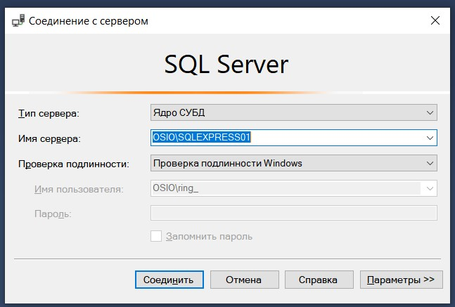
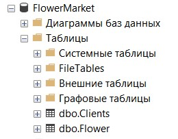
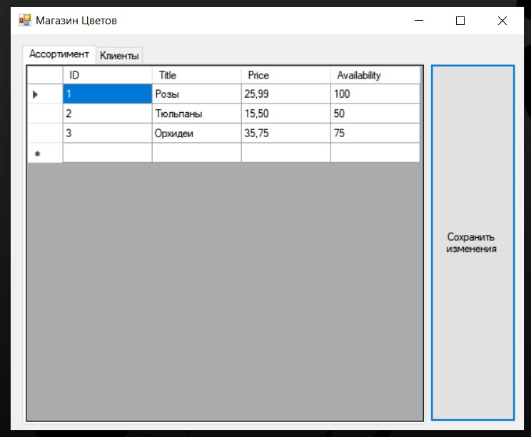

### Задание
Создать базу магазин цветов с таблицами Товары и Клиенты
заполнить тестовыми данными.

Создать приложение для вывода данных из БД при помощи LINQ.

---
### Инструменты разработки

- SQL Server Management Studio 20 

- Visual Studio 2022 

### Настройка подключения к БД перед запуском
---

Перед запуском прложения нужно настроить подключение к БД. 

В SQL Server добавить базу данных.
База данных FlowerMarket.sql в папке bd

И изменить настройки подключения к БД в коде.

1. В файле Form1.cs в строке 19 указываете имя своего сервера `con.ConnectionString = "Data Source= свои данные SQL Server;"`

   

2. В БД Долждны быть 2 таблицы: Clients и Flower

   

И если всё это есть можно запускать приложение через WindowsFormsApp1.sln

